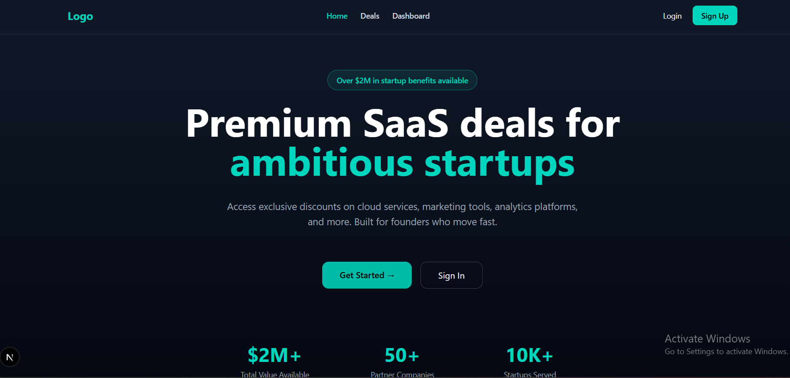
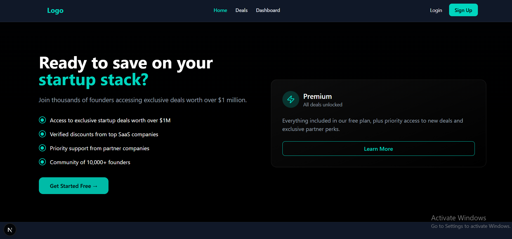

# StartupPerks (Start up benifiting platform) — README

This repository contains a StartupPerks application (Next.js frontend + Express/MongoDB backend) focused on authentication, deals browsing, and a basic claim workflow.

## 1) End-to-End Application Flow

- User visits the frontend (Next.js) and can browse the landing and deals pages.
- Users register and authenticate via JWT tokens returned by the backend.
- Authenticated users may claim deals; claims are stored and shown on the Dashboard.
- The backend exposes REST endpoints for authentication, deals, and claims; the frontend calls these endpoints using fetch with the JWT in `Authorization: Bearer <token>`.

Typical flow:

- Sign up → Backend creates user, hashes password, returns JWT.
- Login → Backend validates credentials, returns JWT.
- Browse deals → Frontend GETs `/api/deals` (public).
- View deal → Frontend GETs `/api/deals/:id` (public).
- Claim deal → Frontend POSTs to `/api/claims` (protected). Backend creates Claim, increments Deal counters.

## 2) Authentication and Authorization Strategy

- Authentication: JSON Web Tokens (JWT). Backend signs tokens with `JWT_SECRET` and 30d expiry.
- Passwords: hashed using `bcryptjs` before save (Mongoose pre-save hook).
- Protected routes: middleware (`middleware/auth.js`) verifies JWT and attaches `req.user` with `userId`.
- Frontend: stores token in `localStorage` and sends `Authorization: Bearer <token>` on protected requests.

Security notes (current):

- Tokens are stored in `localStorage` (simple but vulnerable to XSS). For production prefer HttpOnly secure cookies and refresh-token rotation.

## 3) Internal Flow of Claiming a Deal

1. Frontend initiates claim by POSTing `{ dealId }` to `/api/claims` with Authorization header.
2. Backend `auth` middleware verifies token and sets `req.user.userId`.
3. Claim controller:
   - Verifies deal exists and is active.
   - Ensures user hasn't already claimed the same deal (unique index on `{ user, deal }`).
   - Creates a `Claim` document with a generated `claimCode`.
   - Increments `Deal.claimCount`.
   - Returns claim data to frontend.
4. Frontend displays claim code and stores claimed state (and dashboard shows claim list).

## 4) Interaction Between Frontend and Backend

- Frontend (Next.js pages/components) call backend REST API endpoints:
  - `POST /api/auth/register` — register user
  - `POST /api/auth/login` — login
  - `GET /api/auth/me` — current user (protected)
  - `GET /api/deals` — list deals (supports `search`, `category`, `accessLevel`, `page`, `limit`)
  - `GET /api/deals/:id` — deal details
  - `POST /api/claims` — claim a deal (protected)
  - `GET /api/claims/user/claims` — get user's claims (protected)
  - `GET /api/claims/stats` — user's claim stats (protected)

- Communication uses JSON over HTTP. Protected endpoints require `Authorization: Bearer <token>` header.

## 5) Known Limitations or Weak Points

- Tokens stored in `localStorage` (XSS risk).
- No email verification flow implemented (users marked verified by default in simplified version).
- No rate limiting or brute-force protections on auth endpoints.
- Minimal input sanitization; MongoDB injection attack surface exists if unescaped inputs are used in dynamic queries.
- Error handling is basic; some endpoints may expose stack traces in development.
- No tests included.

## 6) Improvements Required for Production Readiness

- Authentication & Security:
  - Use HttpOnly, Secure cookies for access/refresh token pair and implement refresh tokens.
  - Implement email verification and password reset flows.
  - Add rate limiting (e.g. `express-rate-limit`) and abuse detection.
  - Harden CORS and set security headers (Helmet).
  - Input validation and sanitization (e.g. `express-validator`, `mongo-sanitize`).

- Infrastructure & Ops:
  - Move MongoDB to managed cluster (Atlas) or production-grade hosted DB with backups.
  - Add logging (structured logs, Sentry) and monitoring.
  - Use environment-specific config and secrets management.
  - Add CI with tests and linting.
  - Containerize and deploy (Vercel for frontend, Railway/Heroku/AWS for backend).

- Data & Features:
  - Add admin dashboard for approving/rejecting claims.
  - Add full-text search / Elasticsearch if search needs scale.
  - Add pagination, caching, and CDNs for static assets.

## 7) UI and Performance Considerations

- UI:
  - Responsive design implemented with Tailwind CSS.
  - Framer Motion used for subtle entry/hover animations.
  - Keep animation durations short and limit layout-shifting effects.

- Performance:
  - Server-side rendering (Next.js) can be used for SEO-critical pages; current pages are client-heavy.
  - Use pagination and API-side limits to avoid returning large datasets.
  - Add caching (HTTP caching, Redis) for frequently-read data (featured deals, categories).
  - Optimize images and serve via CDN.

## UI Preview




## Development — How to run locally

1. Install dependencies

```bash
# Frontend
cd frontend && npm install

# Backend
cd ../backend && npm install
```

2. Ensure MongoDB is available. For development use local MongoDB (`mongod`) or configure `MONGODB_URI` in `backend/.env`.

3. Start services

```bash
# Start backend
cd backend && npm run dev

# Start frontend
cd ../frontend && npm run dev
```

4. Seed sample deals (optional)

```bash
cd backend && npm run seed
```

5. Open the frontend: http://localhost:3000
